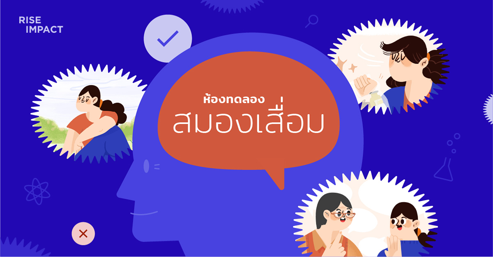

<h1 align="center">Dementia Survey 🧠</h1>

Dementia is a survey app for [RiseImpact](https://riseimpact.co/) a social corporate. 
The purpose of this survey is to demonstrate the dementia symptoms, how it different from alzheimers and how we can prevent them. This web application is builts using ReactJS + Vite + TailwindCSS connected to google sheet via sheety API and deployed on Cloudflare Pages.

พาไปทำความรู้จักภาวะสมองเสื่อม การดูแลรักษา การป้องกันลดความเสี่ยงเบื้องต้น โดยคุณสามารถร่วมเลือกรูปแบบการคัดกรองคัดแยกภาวะสมองเสื่อมที่คุณต้องการได้ ภายใน 10 นาที

